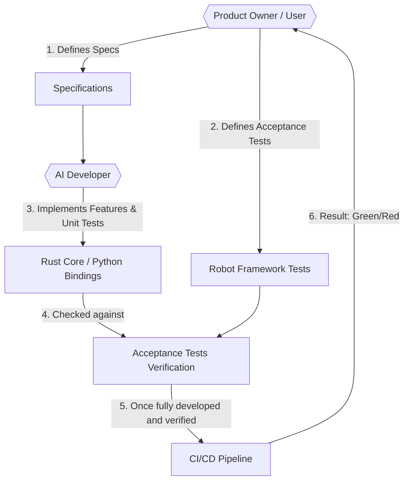

<div align="center">
  
</div>

# Tabularix

Smart data extraction from Excel documents.

Tabularix is a high-performance framework designed to identify, extract, and organize "hidden data" trapped in fragmented Excel files, transforming it into clean, structured formats (such as Parquet or Arrow) ready for AI and advanced analytics.

Developed as a direct continuation of the [Archery](https://github.com/RomualdRousseau/Archery) framework, it inherits and builds upon its core paradigms to optimize data extraction for modern high-performance requirements.

> [!WARNING]
> This project is developed using AI coding assistants under a strict [Black Box Development Methodology](#black-box-development-methodology) framework.
>
> The codebase is treated as a black box, with all implementations and internal tests generated by AI agents to satisfy human-written behavior specifications.

## Core Features

- **High-Performance Rust Core**: Performs CPU-intensive Excel manipulation, cell/marker searches, cropping, and data cleaning at native speeds.
- **Python Scripting Ergonomics**: Exposed to Python via bindings, enabling "Configuration as Code" using familiar scripting tools and syntax.
- **Data Integrations**: Seamless conversion of extracted tables into Apache Parquet, Pandas DataFrames, Apache Arrow tables, or querying with DuckDB.

## Repository Structure

```text
├── docs/               # Project documentation and pitches
├── justfile            # Task runner recipes (e.g. formatting, updates)
├── mise.toml           # Toolchain manager configuration (mise)
└── README.md           # Project overview and development guidelines
```

## Getting Started

### Prerequisites

This project uses [mise](https://mise.jdx.dev/) for tool version management and [just](https://github.com/casey/just) as a command runner. Make sure both are installed on your system.

### Toolchain Setup

To install all required language toolchains (Rust, Python, etc.) and developer tools, run:

```bash
mise install
```

### Formatting and Linting

To run pre-commit quality checks and formatting hooks locally:

```bash
just prek
```

## Black Box Development Methodology

This project is built using the **Black Box Development** methodology, a paradigm focused on a strict separation of concerns between specification and implementation. Under this approach, the codebase is treated as a "black box" by the Product Owner.

### Split of Responsibilities



- **Product Owner (User)**: Focuses entirely on defining the desired behavior. The User defines high-level specifications and acceptance tests in plain English and validates features without ever needing to read or write application code.
- **AI Developer**: Responsible for interpreting the requirements, implementing the application code, creating the Python bindings, writing the internal unit/integration tests, and verifying that the acceptance tests are correctly passing.

### Tech Stack & Architecture

To support this development model while meeting the project's performance and safety goals:

1. **Rust Core Engine**: Rust is used to build the core data-extraction engine, ensuring native performance for CPU-intensive Excel operations and strict memory safety guarantees.
2. **Python Bindings (PyO3)**: Exposed via PyO3 to provide an ergonomic scripting interface for configuring extraction recipes.
3. **Robot Framework**: Acceptance tests are defined using Keyword-Driven specifications. It tests the Python interface directly to verify extraction results.

### Automated Quality Gates

To ensure the "Black Box" does not accumulate technical debt or security flaws, the CI/CD pipeline enforces 6 mandatory verification gates:

> [!IMPORTANT]
> All gates must pass before any code change can be merged.

1. **Gate 1: Compilation** – Verifies that the Rust code compiles cleanly and Python types are correct.
2. **Gate 2: Strict Linting** – Enforces idiomatic code patterns using `cargo clippy` with `pedantic` and `restriction` lint groups.
3. **Gate 3: Static Security (SAST)** – Performs security audits (e.g., `cargo audit`) to scan for known vulnerabilities in dependencies.
4. **Gate 4: Unit & Integration Tests** – Runs the developer's internal test suites (`cargo test`).
5. **Gate 5: AI Code Reviewer** – An independent AI agent reviews the Pull Request against Clean Code, SOLID, and DRY principles, ensuring no hardcoded bypasses of acceptance tests exist.
6. **Gate 6: Acceptance Tests** – Executes the User's Robot Framework tests to verify final data extraction behavior.

## License

Tabularix is dual-licensed under the Apache 2.0 and MIT licenses.

- Apache License, Version 2.0 ([LICENSE-APACHE](LICENSE-APACHE) or http://www.apache.org/licenses/LICENSE-2.0)
- MIT License ([LICENSE-MIT](LICENSE-MIT) or http://opensource.org/licenses/MIT)

at your option.

Unless you explicitly state otherwise, any contribution intentionally submitted for inclusion in Tabularix by you, as defined in the Apache-2.0 license, shall be dually licensed as above, without any additional terms or conditions.
