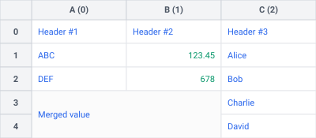
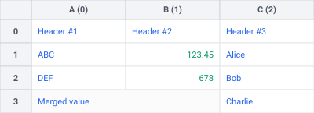
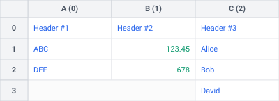
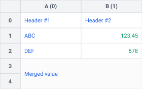
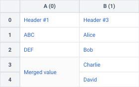
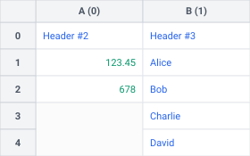

# 📚 API Reference

This page describes the public API exposed by the Tabularix library.

---

## Functions

<!-- prettier-ignore -->
::: tabularix.load_workbook
    options:
      heading_level: 3

---

## Classes

<!-- prettier-ignore -->
::: tabularix.Workbook
    options:
      heading_level: 3

---

<!-- prettier-ignore -->
::: tabularix.Sheet
    options:
      heading_level: 3
      members:
        - name
        - shape
        - get_cell_value
        - set_cell_value
        - to_svg

<!-- drow_row() -->

<!-- prettier-ignore -->
::: tabularix.Sheet.drop_row
    options:
      heading_level: 4
      show_root_full_path: false

<!-- prettier-ignore -->
!!! example "Example"

    === "Non-merged"

        ```python title="Drop non-merged row" linenums="1"
        sheet.drop_row(1)
        ```

        | Before | After |
        | :---: | :---: |
        |  |  |

    === "Merged (non-first)"

        ```python title="Drop merged row (non-first)" linenums="1"
        sheet.drop_row(4)
        ```

        | Before | After |
        | :---: | :---: |
        |  |  |

    === "Merged (first)"

        ```python title="Drop merged row (first)" linenums="1"
        sheet.drop_row(3)
        ```

        | Before | After |
        | :---: | :---: |
        |  |  |

<!-- drop_column() -->

<!-- prettier-ignore -->
::: tabularix.Sheet.drop_column
    options:
      heading_level: 4
      show_root_full_path: false

<!-- prettier-ignore -->
!!! example "Example"

    === "Non-merged"

        ```python title="Drop non-merged column" linenums="1"
        sheet.drop_column(2)
        ```

        | Before | After |
        | :---: | :---: |
        |  |  |

    === "Merged (non-first)"

        ```python title="Drop merged column (non-first)" linenums="1"
        sheet.drop_column(1)
        ```

        | Before | After |
        | :---: | :---: |
        |  |  |

    === "Merged (first)"

        ```python title="Drop merged column (first)" linenums="1"
        sheet.drop_column(0)
        ```

        | Before | After |
        | :---: | :---: |
        |  |  |
