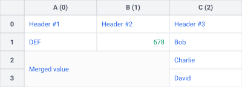
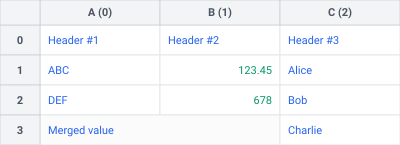
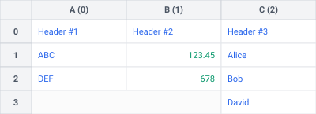
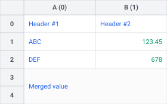
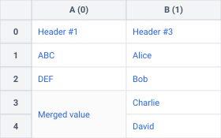
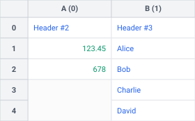
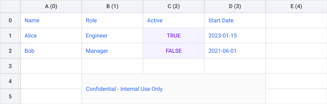
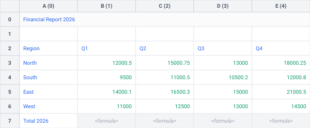

# 📚 API Reference

This page describes the public API exposed by the Tabularix library.

---

## Functions

<!-- prettier-ignore -->
::: tabularix.load_workbook
    options:
      heading_level: 3

<!-- prettier-ignore -->
::: tabularix.value
    options:
      heading_level: 3

<!-- prettier-ignore -->
::: tabularix.regex
    options:
      heading_level: 3

<!-- prettier-ignore -->
::: tabularix.empty
    options:
      heading_level: 3

<!-- prettier-ignore -->
::: tabularix.non_empty
    options:
      heading_level: 3

<!-- prettier-ignore -->
::: tabularix.any
    options:
      heading_level: 3

---

## Classes

<!-- prettier-ignore -->
::: tabularix.Workbook
    options:
      heading_level: 3

---

<!-- prettier-ignore -->
::: tabularix.Sheet
    options:
      heading_level: 3
      members:
        - name
        - shape
        - copy
        - get_cell_value
        - set_cell_value
        - search_range
        - search_range_relative
        - to_svg

<!-- drow_row() -->

<!-- prettier-ignore -->
::: tabularix.Sheet.drop_row
    options:
      heading_level: 4
      show_root_full_path: false

<!-- prettier-ignore -->
!!! example "Example"

    === "Non-merged"

        ```python title="Drop non-merged row" linenums="1"
        sheet.drop_row(1)
        ```

        | Before | After |
        | :---: | :---: |
        | [](assets/sheet_simple.svg) | [](assets/drop_row_non_merged.svg) |

    === "Merged (non-first)"

        ```python title="Drop merged row (non-first)" linenums="1"
        sheet.drop_row(4)
        ```

        | Before | After |
        | :---: | :---: |
        | [](assets/sheet_simple.svg) | [](assets/drop_row_merged_non_first.svg) |

    === "Merged (first)"

        ```python title="Drop merged row (first)" linenums="1"
        sheet.drop_row(3)
        ```

        | Before | After |
        | :---: | :---: |
        | [](assets/sheet_simple.svg) | [](assets/drop_row_merged_first.svg) |

<!-- drop_column() -->

<!-- prettier-ignore -->
::: tabularix.Sheet.drop_column
    options:
      heading_level: 4
      show_root_full_path: false

<!-- prettier-ignore -->
!!! example "Example"

    === "Non-merged"

        ```python title="Drop non-merged column" linenums="1"
        sheet.drop_column(2)
        ```

        | Before | After |
        | :---: | :---: |
        | [](assets/sheet_simple.svg) | [](assets/drop_column_non_merged.svg) |

    === "Merged (non-first)"

        ```python title="Drop merged column (non-first)" linenums="1"
        sheet.drop_column(1)
        ```

        | Before | After |
        | :---: | :---: |
        | [](assets/sheet_simple.svg) | [](assets/drop_column_merged_non_first.svg) |

    === "Merged (first)"

        ```python title="Drop merged column (first)" linenums="1"
        sheet.drop_column(0)
        ```

        | Before | After |
        | :---: | :---: |
        | [](assets/sheet_simple.svg) | [](assets/drop_column_merged_first.svg) |

<!-- search_and_drop() -->

<!-- prettier-ignore -->
::: tabularix.Sheet.search_and_drop
    options:
      heading_level: 4
      show_root_full_path: false

<!-- prettier-ignore -->
!!! example "Example"

    === "String Match (Drop Top)"

        ```python title="Search string and drop top" linenums="1"
        sheet.search_and_drop("Name", "top")
        ```

        | Before | After |
        | :---: | :---: |
        | [](assets/sheet_complex.svg) | [](assets/search_and_drop_str_top.svg) |

    === "Regex Match (Drop Bottom)"

        ```python title="Search regex and drop bottom" linenums="1"
        import re

        sheet.search_and_drop(re.compile(r"Total \d{4}"), "bottom")
        ```

        | Before | After |
        | :---: | :---: |
        | [](assets/sheet_complex.svg) | [](assets/search_and_drop_regex_bottom.svg) |

---

<!-- prettier-ignore -->
::: tabularix.RowPattern
    options:
      heading_level: 3

---

<!-- prettier-ignore -->
::: tabularix.RangeMatcher
    options:
      heading_level: 3

---

<!-- prettier-ignore -->
::: tabularix.Range
    options:
      heading_level: 3
