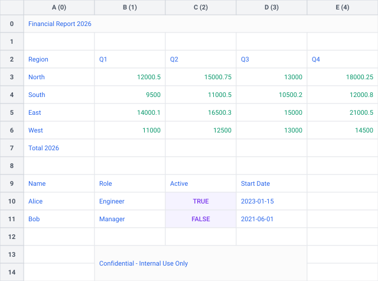

# ⚡ Quickstart

Getting started with **Tabularix** is easy. Tabularix is a fast, layout-resilient engine for parsing Excel spreadsheets and extracting structured tables.

Written in Rust for maximum speed, it integrates directly with Python to provide zero-copy sharing with frameworks like PyArrow, Polars, Pandas and DuckDB.

---

## 📦 Installation

Install the stable package directly from PyPI:

```bash
pip install tabularix
```

---

## 🚀 Tutorial: Extracting Tables from Messy Sheets

Excel spreadsheets are often structured for humans to read, not for computers to parse. They frequently contain header titles, metadata rows, empty spacing rows, and multiple tables nested in a single worksheet.

In this tutorial, we will take a messy spreadsheet and programmatically locate, extract and clean a table using Tabularix's **High-Level API**. We will then use it with modern data frameworks (Pandas, Polars, DuckDB).

### Step 1: Visual Structure Analysis

The first step in extracting tables from a spreadsheet is understanding its layout. Tabularix allows you to render the worksheet's structure into a beautifully styled SVG layout file:

```python
from tabularix import load_workbook

# Load the workbook.
workbook = load_workbook("tests/data/sample.xlsx")

# Get the target worksheet.
sheet = workbook.get_sheet("complex")

# Export the sheet to SVG.
sheet.to_svg("sheet.svg")
```

The resulting structural layout is shown below:



It highlights cell borders, merged regions, empty rows, and cell types (numeric, text, formulas) so you can visually plan your extraction patterns without opening Excel.

---

### Step 2: Define Layout Patterns

In this example, we need to extract the sales table located at the top of the sheet. Instead of hardcoding cell ranges like `A3:E8` (which break if a row is added or deleted at the top), Tabularix lets you define patterns using `group` (for one-dimensional horizontal or vertical group of cells) and `grid` (for two-dimensional row/column arrays).

Let's define a match pattern for the header row and a match pattern for the data rows:

```python
from tabularix import grid, group, non_empty, regex, value

# Define the pattern for the header row.
# The header row starts with "Region" and is followed by four Quarter columns.
header_pattern = group(
    value("Region"),                           # Match the static string.
    regex(r"^Q[1-4]$").repeat(min=4, max=4)    # Match the quarter headers.
)

# Define the pattern for the data rows.
# Each data row starts with a region name and ends with four non-empty cells.
data_pattern = grid(
    group(
        regex(r"^(?!Total).*$"),            # Match any string except "Total".
        non_empty().repeat(min=4, max=4)    # Match the quarterly sales amounts.
    ).one_or_more()
)
```

---

### Step 3: Extract the Structured Table

Using the defined patterns, we extract the structured `Table` object using the high-level helper `extract_table_with_header_and_data`. This helper automatically handles finding the header and locating the data range relative to it:

```python
from tabularix import extract_table_with_header_and_data

# Extract the table from the sheet using the high-level API.
table = extract_table_with_header_and_data(
    sheet,
    header_pattern,
    data_pattern,
    clean_names=True
)

print("Columns:", table.columns)
# Output: ['region', 'q1', 'q2', 'q3', 'q4']
print("Table Shape:", table.shape)
# Output: (4, 5)
```

---

### Step 4: Zero-Copy Integration (Arrow, Polars, Pandas, DuckDB)

Tabularix fully supports the standard **[Arrow PyCapsule Interface](https://arrow.apache.org/docs/format/CDataInterface/PyCapsuleInterface.html)**, allowing you to export your parsed table to modern data frameworks with zero-copy overhead.

```python
# Zero-copy load into a Pandas dataframe.
df_pandas = table.to_arrow().to_pandas()
print("Pandas dataframe created:")
print(df_pandas.head())

# Zero-copy load into a Polars dataframe.
import polars as pl
df_polars = pl.from_arrow(table.to_arrow())
print("Polars dataframe created:")
print(df_polars)

# Zero-copy load and query in DuckDB (directly consumes the Table instance).
import duckdb
rel_duckdb = duckdb.from_arrow(table)
res_duckdb = rel_duckdb.query("sales_table", "SELECT * FROM sales_table WHERE Q1 > 12000")
print("DuckDB query result:")
print(res_duckdb)
```

---

## 🛠️ Low-Level Coordinate Control

While the High-Level API is perfect for standard vertical or horizontal tables, some complex layouts require more control. In these situations, you can use Tabularix's **Low-Level API** to perform explicit range searches, inspect boundary coordinates, and construct matcher objects manually.

Here is the equivalent workflow using the Low-Level API.

### 1. Compile Matchers Manually

Instead of passing patterns directly to high-level helpers, convert them into `RangeMatcher` objects bound to specific layout directions:

```python
# Compile the patterns into matchers.

# Match the header row scanning from left to right.
header_matcher = header_pattern.to_matcher(direction="LR")

# Match data rows scanning top to bottom, and columns left to right.
data_matcher = data_pattern.to_matcher(outer_direction="TB", inner_direction="LR")
```

### 2. Search and Scan Ranges

Scan the sheet dynamically to locate the boundaries of the matching regions. This returns `Range` coordinates:

```python
# Scan the sheet for the header row.
header_range = sheet.search_range(header_matcher)
if header_range is None:
    raise ValueError("Header not found")

print(f"Table header found: {header_range}")
# Output: Range(A3:E3, cols=0..4, rows=2..2)

# Scan for data rows located below the matched header.
data_range = sheet.search_range_relative(data_matcher, below=header_range)
if data_range is None:
    raise ValueError("Data not found")

print(f"Table data found: {data_range}")
# Output: Range(A4:E7, cols=0..4, rows=3..6)
```

### 3. Extract via Ranges

Once the header and data coordinate ranges are located, pass them to `sheet.extract_table` to retrieve the structured table:

```python
# Extract the table using explicit ranges.
table = sheet.extract_table(data_range, header_range, clean_names=True)
```

---

## ➡️ Next Steps

- Learn more about [Range Matching](matching_ranges.md).
- Learn more about [Table Extraction](table_extraction.md).
- Visit the [API Reference](api.md) to explore all parameter options for `extract_table` (such as flattening hierarchical multi-row headers).
