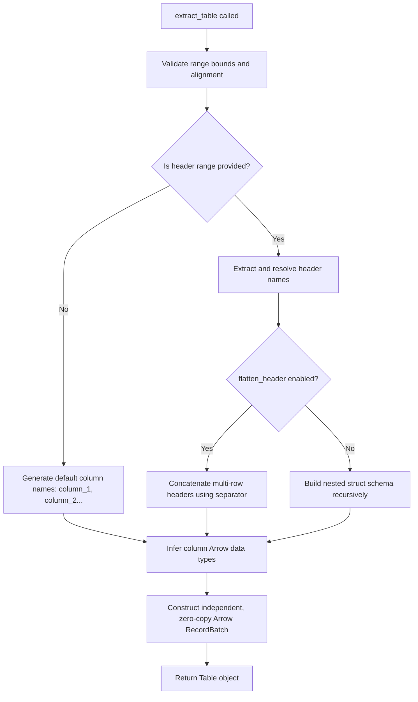

# 📋 Table Extraction

This document provides a detailed explanation of the algorithm used by Tabularix to extract structured tables from coordinate layout ranges.

Tabularix provides two interfaces for table extraction: the **High-Level API** and the **Low-Level API**. Both interfaces invoke the same core extraction pipeline, `Sheet.extract_table`, under the hood:

- **High-Level API** (`extract_table_with_header_and_data` and `extract_table_between_header_and_footer`): Automatically searches the worksheet to locate the matching layout coordinate ranges (header, footer and data). Once located, it passes these ranges to the core pipeline.
- **Low-Level API**: Allows you to perform manual coordinate scans and pass the resulting coordinate ranges directly to `Sheet.extract_table`.

---

## 1. Algorithmic Workflow

When `Sheet.extract_table` is called, the library executes a multi-step pipeline to transform cell ranges into a strongly typed, structured `Table` object:



---

## 2. Validation & Alignment

To ensure data integrity, the library validates the coordinates before performing any extraction operations. The verification rules support both **vertical layouts** (standard column-oriented tables) and **horizontal layouts** (transposed/row-oriented tables):

1.  **Dimension bounds check**: Verifies that both the `data` and `header` ranges exist within the actual column/row boundaries of the current spreadsheet.
2.  **Range Alignment**: The header and data ranges must align along one of their axes:
    - **Vertical Layouts** (data flows vertically in columns): The header and data must share the exact same column span (`header.start_col == data.start_col` and `header.end_col == data.end_col`).
    - **Horizontal Layouts** (data flows horizontally in rows): The header and data must share the exact same row span (`header.start_row == data.start_row` and `header.end_row == data.end_row`).
3.  **Non-overlapping Order**: The header and data ranges must not overlap along their non-aligned axis:
    - **Vertical Layouts**: The header must reside strictly above or below the data range without overlapping (i.e., `header.end_row < data.start_row` or `data.end_row < header.start_row`).
    - **Horizontal Layouts**: The header must reside strictly to the left or right of the data range without overlapping (i.e., `header.end_col < data.start_col` or `data.end_col < header.start_col`).

Any violation of these rules immediately raises a `ValueError` or `IndexError`.

---

## 3. Column Name Resolution & Deduplication

For each column in the target range:

1. **Merged cell lookup**: If a column index falls inside a merged region, the cell value is automatically fetched from the top-left (parent) cell of the merge region.
2. **Name Cleaning** (if `clean_names=True`):
    - Non-alphanumeric characters (spaces, punctuation, symbols) are replaced by a single underscore `_`.
    - Continuous multiple underscores are collapsed.
    - Any leading or trailing underscores are stripped.
    - Text is cast to lowercase.
3. **Empty Value Fallback**: If a column name is empty or becomes empty after cleaning, it defaults to `column_{index}` where `index` is the 1-based column position.
4. **Sibling Deduplication**: Column names must be unique within their group/struct level. If a duplicate is encountered, a suffix (e.g. `_1`, `_2`) is appended dynamically until the name is unique.

---

## 4. Multi-Row Headers

Consider a spreadsheet containing the following 2-row header layout where the top row contains merged cells for the years:

| Col A                   | Col B        | Col C                   | Col D        |
| :---------------------- | :----------- | :---------------------- | :----------- |
| **`2026`** (merged A-B) | _(merged)_   | **`2027`** (merged C-D) | _(merged)_   |
| **`Forecast`**          | **`Actual`** | **`Forecast`**          | **`Actual`** |
| `100`                   | `120`        | `110`                   | `130`        |

---

### 4.1 Nested Structure (`flatten_header=False`)

When a header has multiple rows, the structure is preserved hierarchically using Apache Arrow `Struct` types. Contiguous columns sharing the same parent cell label are grouped into struct subfields. The algorithm runs recursively:

- **Base Case**: The last header row resolves to direct primitive data columns.
- **Recursive Case**: Upper header rows group contiguous columns sharing the same label. Each group is recursively parsed into a `StructArray` with subfields.

**Resulting Schema & Columns:**

```text
Table Schema
├── 2026: Struct
│   ├── forecast: Int64
│   └── actual: Int64
└── 2027: Struct
    ├── forecast: Int64
    └── actual: Int64
```

---

### 4.2 Flattened Structure (`flatten_header=True`)

Labels from all header rows for a column are joined sequentially from top to bottom using the `header_separator` (default `_`), yielding a standard flat table with simplified, combined header names.

**Resulting Schema & Columns:**

```text
Table Schema
├── 2026_forecast: Int64
├── 2026_actual: Int64
├── 2027_forecast: Int64
└── 2027_actual: Int64
```

---

## 5. Type Coercion & Inference

Each column of cells is scanned to infer its optimal representation:

- **Null representation**: Empty cells and Excel error cells (`#DIV/0!`, `#VALUE!`, etc.) are mapped to nulls.
- **Boolean**: Inferred if a column contains only booleans and empty/error cells.
- **Integer**: Inferred if a column contains only integers and empty/error cells.
- **Float**: Inferred if a column contains integers, floats, and empty/error cells.
- **String (Fallback)**: If any cell contains a string, or if incompatible types (like booleans and numbers) are mixed, the entire column is coerced to strings (converting values like `TRUE`, `12.3` to their text representations).
