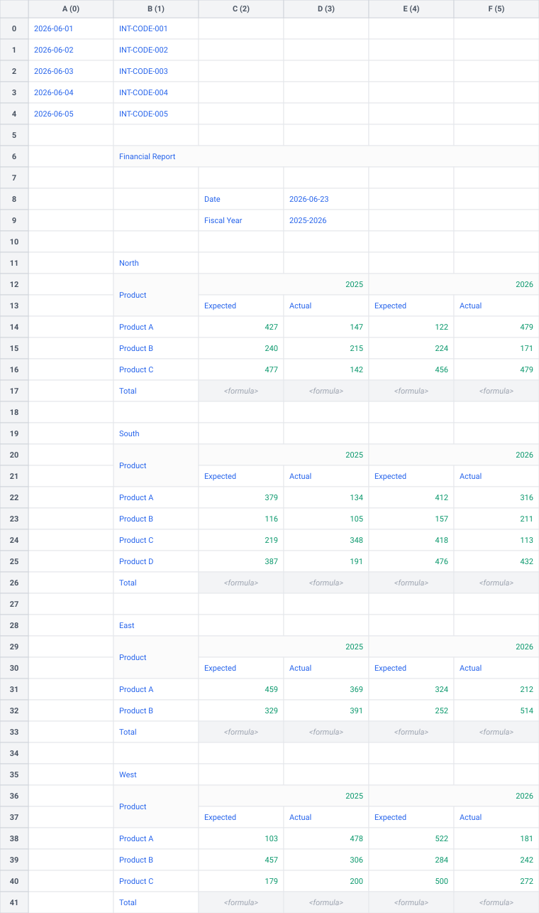

# 🗂️ Extract, Combine, and Project Multiple Tables

In real-world spreadsheets, you will sometimes find multiple independent tables stacked vertically on the same worksheet, alongside key-value metadata scattered outside the main tables (e.g., report dates, fiscal years, or run parameters).

This tutorial guides you through using **Tabularix** to programmatically:

1. Locate and extract horizontal metadata, transposing it into a structured single-row DataFrame using the **High-Level API**.
2. Locate, extract, and combine multiple territory-specific tables from the `"multi-tables"` worksheet of `sample.xlsx` using the **Low-Level API** for coordinate control.
3. Project the extracted metadata onto the combined territory rows using a Polars cross join.

---

## 🔍 The Scenario

Suppose you want to extract data from the following worksheet:

[](../assets/sheet_multi_tables.svg)

The worksheet contains some data we are not interested in at the very top.
Then the **Financial Report** section begins with a metadata block at the top (**Date** and **Fiscal Year**) and four territory tables (**North**, **South**, **East**, and **West**) below it. Each territory table has:

- A title row containing the name of the territory (e.g., `"North"`).
- A two-row header starting with `"Product"` in the top-left cell, followed by fiscal years and performance types.
- A variable number of data rows for products.
- A summary row starting with `"Total"`.

Our goal is to extract all four territory tables and normalize them into a single, tidy DataFrame with the following columns:

- `territory`: String indicating the territory (retrieved from the title row).
- `product`: String indicating the product (retrieved from the data rows).
- `year`: String indicating the fiscal year (unpivoted from the nested headers).
- `expected`: Floating-point number indicating the expected sales amount.
- `actual`: Floating-point number indicating the actual sales amount.

---

## 🛠️ Step 1: Extract Metadata as a Horizontal Table

Metadata is often stored horizontally: keys in one column and values in the adjacent column. Because this metadata block exists as a single self-contained horizontal table, we can use Tabularix's **High-Level API** (`extract_table_with_header_and_data`) to parse and extract it in a single step.

### Define the Metadata Patterns

We define vertical patterns for the header column matching "Date" or "Fiscal Year", and the data column to the right:

```python
from tabularix import group, regex, non_empty

# Pattern for the vertical header column (one-dimensional cell sequence).
header_pattern = group(regex(r"^(Date|Fiscal Year)$").repeat(2, 2))

# Pattern for the vertical data column (one-dimensional cell sequence).
data_pattern = group(non_empty().repeat(2, 2))
```

### Extracting the Horizontal Table

We pass the patterns to the High-Level API helper, specifying that the table flows primarily from left to right (`main_direction="LR"`) and then from top to bottom (`inner_direction="TB"`):

```python
from typing import cast
import polars as pl
from tabularix import Sheet, extract_table_with_header_and_data

def extract_metadata(sheet: Sheet) -> pl.DataFrame:
    # Extract the metadata as a horizontal table.
    table = extract_table_with_header_and_data(
        sheet,
        header_pattern,
        data_pattern,
        main_direction="LR",
        inner_direction="TB",
        clean_names=False,  # Keep original capitalization ('Date', 'Fiscal Year').
    )

    # Cast to pl.DataFrame to satisfy static type checkers.
    df = cast(pl.DataFrame, pl.from_arrow(table.to_arrow()))

    return df
```

---

## 🛠️ Step 2: Define Territory Layout Patterns

To extract the stacked territory tables (North, South, East, West), we must dynamically loop down the sheet, scan for title cells, and extract each table relative to its landmarks. Because this requires dynamic scanning cursor management, we compile our patterns into low-level `RangeMatcher` objects.

```python
from tabularix import any, empty, grid, group, regex, value

# Locate the territory title (one-dimensional group pattern).
territory_pattern = group(regex(r"^(North|South|East|West)$"))
territory_matcher = territory_pattern.to_matcher(direction="LR")

# Locate the two-row merged header (two-dimensional grid pattern).
header_row1 = group(
    value("Product"),
    group(
        regex(r"\d{4}"),
        empty()  # Matches the merged cell next to the year.
    ).zero_or_more()
)
header_row2 = group(
    empty(),  # Matches the merged cell below "Product".
    group(
        value("Expected"),
        value("Actual")
    ).zero_or_more()
)
header_pattern = grid(header_row1, header_row2)
header_matcher = header_pattern.to_matcher(outer_direction="TB", inner_direction="LR")

# Locate the footer row.
footer_pattern = group(
    value("Total"),
    any().zero_or_more()
)
footer_matcher = footer_pattern.to_matcher(direction="LR")
```

---

## 🔄 Step 3: Dynamic Scanning Loop

We scan the worksheet vertically using a `while` loop, advancing our search starting point (`search_row`) below the footer of each extracted table. Because we have explicit boundary coordinates, we extract each sub-table using `sheet.extract_table`:

```python
def extract_territory_tables(sheet: Sheet) -> pl.DataFrame:
    dfs = []
    search_row = 0

    while search_row < sheet.shape[0]:
        # 1. Match the territory name (e.g. "North").
        territory_range = sheet.search_range(territory_matcher, start_row=search_row)
        if territory_range is None:
            break

        territory = str(sheet.get_cell_value(territory_range.start_row, territory_range.start_col))

        # 2. Match the 2-row header range below the title.
        header_range = sheet.search_range(header_matcher, start_row=territory_range.end_row + 1)
        if header_range is None:
            raise ValueError(f"Header not found for {territory}")

        # 3. Match the footer relative to the header.
        footer_range = sheet.search_range_relative(footer_matcher, below=header_range)
        if footer_range is None:
            raise ValueError(f"Footer not found for {territory}")

        # 4. Extract data rows between header and footer.
        data_range = sheet.get_range_between(header_range, footer_range)
        table = sheet.extract_table(
            data_range,
            header=header_range,
            clean_names=True,
            flatten_header=False,
        )

        # 5. Convert to Polars and insert territory as the first column.
        df = cast(pl.DataFrame, pl.from_arrow(table.to_arrow()))
        df = df.select([pl.lit(territory).alias("territory"), pl.all()])

        # 6. Unpack the product struct.
        df = df.with_columns(pl.col("product").struct.field("product"))

        # 7. Unpivot the year columns to rows (all columns not in index are unpivoted).
        df = df.unpivot(
            on=None,
            index=["territory", "product"],
            variable_name="year",
            value_name="metrics",
        )

        # 8. Unnest the metrics struct (containing expected and actual fields).
        df = df.unnest("metrics")

        dfs.append(df)

        # Move the cursor below this table's footer.
        search_row = footer_range.end_row + 1

    return pl.concat(dfs)
```

---

## 🧬 Step 4: Projecting Metadata (Cross Join)

Once we have a single-row metadata DataFrame and a combined 24-row territory DataFrame, we can merge them. A Polars **cross join** acts as a broadcast join, appending the metadata fields (`Date` and `Fiscal Year`) to every row of the combined data dynamically.

```python
# Broadcast metadata to all territory rows.
projected_df = territories_df.join(metadata_df, how="cross")
```

---

## 📄 Complete Implementation Code

The complete, runnable implementation of this tutorial is located at [examples/extract_multiple_tables.py](https://github.com/pcasteran/tabularix/blob/main/examples/extract_multiple_tables.py).

To execute it:

```bash
uv run examples/extract_multiple_tables.py
```

### Script Output

The script outputs three separate stages of the extraction process, culminating in the projected, unified DataFrame:

```text
Extracted Metadata DataFrame:
shape: (1, 2)
┌────────────┬─────────────┐
│ Date       ┆ Fiscal Year │
│ ---        ┆ ---         │
│ date       ┆ str         │
╞════════════╪═════════════╡
│ 2026-06-23 ┆ 2025-2026   │
└────────────┴─────────────┘
----------------------------------------
Combined Territories DataFrame:
shape: (24, 5)
┌───────────┬───────────┬──────┬──────────┬────────┐
│ territory ┆ product   ┆ year ┆ expected ┆ actual │
│ ---       ┆ ---       ┆ ---  ┆ ---      ┆ ---    │
│ str       ┆ str       ┆ str  ┆ f64      ┆ f64    │
╞═══════════╪═══════════╪══════╪══════════╪════════╡
│ North     ┆ Product A ┆ 2025 ┆ 427.0    ┆ 147.0  │
│ North     ┆ Product B ┆ 2025 ┆ 240.0    ┆ 215.0  │
│ North     ┆ Product C ┆ 2025 ┆ 477.0    ┆ 142.0  │
│ North     ┆ Product A ┆ 2026 ┆ 122.0    ┆ 479.0  │
│ North     ┆ Product B ┆ 2026 ┆ 224.0    ┆ 171.0  │
│ …         ┆ …         ┆ …    ┆ …        ┆ …      │
│ West      ┆ Product B ┆ 2025 ┆ 457.0    ┆ 306.0  │
│ West      ┆ Product C ┆ 2025 ┆ 179.0    ┆ 200.0  │
│ West      ┆ Product A ┆ 2026 ┆ 522.0    ┆ 181.0  │
│ West      ┆ Product B ┆ 2026 ┆ 284.0    ┆ 242.0  │
│ West      ┆ Product C ┆ 2026 ┆ 500.0    ┆ 272.0  │
└───────────┴───────────┴──────┴──────────┴────────┘
----------------------------------------
Projected DataFrame:
shape: (24, 7)
┌───────────┬───────────┬──────┬──────────┬────────┬────────────┬─────────────┐
│ territory ┆ product   ┆ year ┆ expected ┆ actual ┆ Date       ┆ Fiscal Year │
│ ---       ┆ ---       ┆ ---  ┆ ---      ┆ ---    ┆ ---        ┆ ---         │
│ str       ┆ str       ┆ str  ┆ f64      ┆ f64    ┆ date       ┆ str         │
╞═══════════╪═══════════╪══════╪══════════╪════════╪════════════╪═════════════╡
│ North     ┆ Product A ┆ 2025 ┆ 427.0    ┆ 147.0  ┆ 2026-06-23 ┆ 2025-2026   │
│ North     ┆ Product B ┆ 2025 ┆ 240.0    ┆ 215.0  ┆ 2026-06-23 ┆ 2025-2026   │
│ North     ┆ Product C ┆ 2025 ┆ 477.0    ┆ 142.0  ┆ 2026-06-23 ┆ 2025-2026   │
│ North     ┆ Product A ┆ 2026 ┆ 122.0    ┆ 479.0  ┆ 2026-06-23 ┆ 2025-2026   │
│ North     ┆ Product B ┆ 2026 ┆ 224.0    ┆ 171.0  ┆ 2026-06-23 ┆ 2025-2026   │
│ …         ┆ …         ┆ …    ┆ …        ┆ …      ┆ …          ┆ …           │
│ West      ┆ Product B ┆ 2025 ┆ 457.0    ┆ 306.0  ┆ 2026-06-23 ┆ 2025-2026   │
│ West      ┆ Product C ┆ 2025 ┆ 179.0    ┆ 200.0  ┆ 2026-06-23 ┆ 2025-2026   │
│ West      ┆ Product A ┆ 2026 ┆ 522.0    ┆ 181.0  ┆ 2026-06-23 ┆ 2025-2026   │
│ West      ┆ Product B ┆ 2026 ┆ 284.0    ┆ 242.0  ┆ 2026-06-23 ┆ 2025-2026   │
│ West      ┆ Product C ┆ 2026 ┆ 500.0    ┆ 272.0  ┆ 2026-06-23 ┆ 2025-2026   │
└───────────┴───────────┴──────┴──────────┴────────┴────────────┴─────────────┘
```
