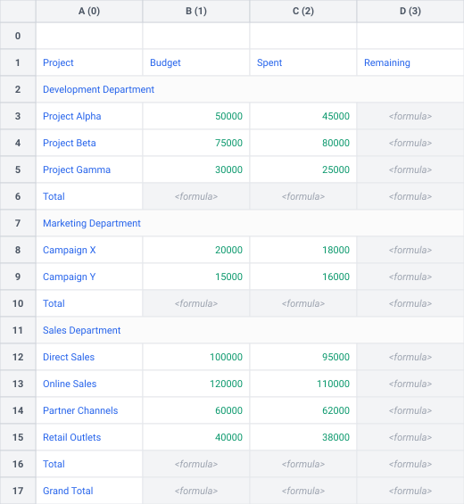

# 🗂️ Extract Tables with Sub-sections

In complex spreadsheets, a single logical table is often split into sub-sections (such as departments, categories, or projects) separated by sub-header row(s) and/or sub-footers row(s) (e.g. sub-total), optionally culminating in a grand total row.

This tutorial guides you through using **Tabularix** to programmatically:

1. Anchor column boundaries using the main table header row.
2. Define match patterns for sub-headers (e.g., department titles) and sub-footers (e.g., `"Total"` rows).
3. Sequentially scan the worksheet in a dynamic loop, calculating sub-section data ranges using `sheet.get_range_between(sub_header_range, sub_footer_range)`.
4. Prepend department names as contextual columns and combine all sub-sections into a single, clean DataFrame.

---

## 🔍 The Scenario

Suppose you want to extract data from the following worksheet:

[](../assets/sheet_sub_sections.svg)

The worksheet contains a main header row (**Project**, **Budget**, **Spent**, **Remaining**) followed by three department sub-sections (**Development Department**, **Marketing Department**, and **Sales Department**). Each department block has:

- A merged sub-header row across columns A:D containing the department title (e.g., `"Development Department"`).
- A variable number of data rows containing project details.
- A sub-footer row starting with `"Total"` containing department subtotals.

The worksheet ends with a grand total summary row starting with `"Grand Total"`.

Our goal is to extract all project data rows across all departments and normalize them into a single, tidy DataFrame with the following columns:

- `department`: String indicating the department (retrieved from the sub-header row).
- `project`: String indicating the project name.
- `budget`: Floating-point number indicating the budget allocation.
- `spent`: Floating-point number indicating the spent amount.
- `remaining`: Floating-point number indicating the remaining balance.

---

## 🛠️ Step 1: Anchor Column Boundaries with Main Header

Before scanning sub-sections, we search for the main header row to establish the table's horizontal column boundaries (`start_col` to `end_col`):

```python
from tabularix import group, value

# Main Header pattern to anchor column boundaries
main_header_pattern = group(
    value("Project"),
    value("Budget"),
    value("Spent"),
    value("Remaining"),
)
main_header_matcher = main_header_pattern.to_matcher(direction="LR")

main_header_range = sheet.search_range(main_header_matcher)
if main_header_range is None:
    raise ValueError("Main table header not found.")
```

---

## 🛠️ Step 2: Define Sub-header and Sub-footer Matchers

To match the sub-headers and sub-footers dynamically across the table, we define patterns using greedy wildcard rules (`any().zero_or_more()`). This ensures that both the sub-header and sub-footer ranges match across the full width of the table (columns A:D), allowing `get_range_between` to calculate the data range directly without manual column alignment math:

```python
from tabularix import any, group, regex, value

# Sub-header pattern matching department names (e.g. "Development Department")
sub_header_pattern = group(regex(r"^.+\s+Department$"), any().zero_or_more())
sub_header_matcher = sub_header_pattern.to_matcher(direction="LR")

# Sub-footer pattern matching section totals (starts with "Total")
sub_footer_pattern = group(value("Total"), any().zero_or_more())
sub_footer_matcher = sub_footer_pattern.to_matcher(direction="LR")
```

---

## 🔄 Step 3: Dynamic Sub-section Scanning Loop

We scan the worksheet sequentially starting below the main header row (`search_row = main_header_range.end_row + 1`).

For each sub-section:

1. Locate the sub-header range (`sub_header_range`) starting from `search_row`.
2. Retrieve the department name from the sub-header top-left cell.
3. Locate the sub-footer range (`sub_footer_range`) relative to `sub_header_range` using `below=sub_header_range`.
4. Calculate the data range boundaries using `sheet.get_range_between(sub_header_range, sub_footer_range)`.
5. Extract the table using the **main header** and **data** ranges: `sheet.extract_table(data_range, header=main_header_range, clean_names=True)`.
6. Prepend the `department` column to the DataFrame.
7. Advance `search_row` past the sub-footer to scan the next section.

```python
from typing import cast
import polars as pl
import tabularix as tx

dfs = []
search_row = main_header_range.end_row + 1

while search_row < sheet.shape[0]:
    # 1. Match sub-header (department title)
    sub_header_range = sheet.search_range(sub_header_matcher, start_row=search_row)
    if sub_header_range is None:
        break

    department = str(sheet.get_cell_value(sub_header_range.start_row, sub_header_range.start_col))

    # 2. Match sub-footer ("Total") relative to sub-header
    sub_footer_range = sheet.search_range_relative(sub_footer_matcher, below=sub_header_range)
    if sub_footer_range is None:
        raise ValueError(f"Sub-footer not found for department '{department}'.")

    # 3. Calculate data rows range between sub-header and sub-footer
    data_range = sheet.get_range_between(sub_header_range, sub_footer_range)

    # 4. Extract table using main_header_range for column names
    table = sheet.extract_table(
        data_range,
        header=main_header_range,
        clean_names=True,
    )

    df = cast(pl.DataFrame, pl.from_arrow(table.to_arrow()))
    df = df.select([pl.lit(department).alias("department"), pl.all()])
    dfs.append(df)

    # 5. Move cursor past the sub-footer
    search_row = sub_footer_range.end_row + 1

combined_df = pl.concat(dfs)
```

---

## 📄 Complete Implementation Code

The complete, runnable implementation of this tutorial is located at [examples/extract_sub_sections.py](https://github.com/pcasteran/tabularix/blob/main/examples/extract_sub_sections.py).

To execute it:

```bash
uv run examples/extract_sub_sections.py
```

### Script Output

```text
Extracted Sub-sections DataFrame:
shape: (9, 5)
┌────────────────────────┬──────────────────┬──────────┬──────────┬───────────┐
│ department             ┆ project          ┆ budget   ┆ spent    ┆ remaining │
│ ---                    ┆ ---              ┆ ---      ┆ ---      ┆ ---       │
│ str                    ┆ str              ┆ f64      ┆ f64      ┆ str       │
╞═══════════════════════════════════════════╪══════════╪══════════╪═══════════╡
│ Development Department ┆ Project Alpha    ┆ 50000.0  ┆ 45000.0  ┆ null      │
│ Development Department ┆ Project Beta     ┆ 75000.0  ┆ 80000.0  ┆ null      │
│ Development Department ┆ Project Gamma    ┆ 30000.0  ┆ 25000.0  ┆ null      │
│ Marketing Department   ┆ Campaign X       ┆ 20000.0  ┆ 18000.0  ┆ null      │
│ Marketing Department   ┆ Campaign Y       ┆ 15000.0  ┆ 16000.0  ┆ null      │
│ Sales Department       ┆ Direct Sales     ┆ 100000.0 ┆ 95000.0  ┆ null      │
│ Sales Department       ┆ Online Sales     ┆ 120000.0 ┆ 110000.0 ┆ null      │
│ Sales Department       ┆ Partner Channels ┆ 60000.0  ┆ 62000.0  ┆ null      │
│ Sales Department       ┆ Retail Outlets   ┆ 40000.0  ┆ 38000.0  ┆ null      │
└────────────────────────┴──────────────────┴──────────┴──────────┴───────────┘
```

!!! note "Formula Cells and Cached Values"

    In Excel, formula cells saved by spreadsheet software contain pre-calculated cached values that Tabularix reads directly. If a worksheet is generated programmatically without cached formula values, formula cells evaluate to `null`.
